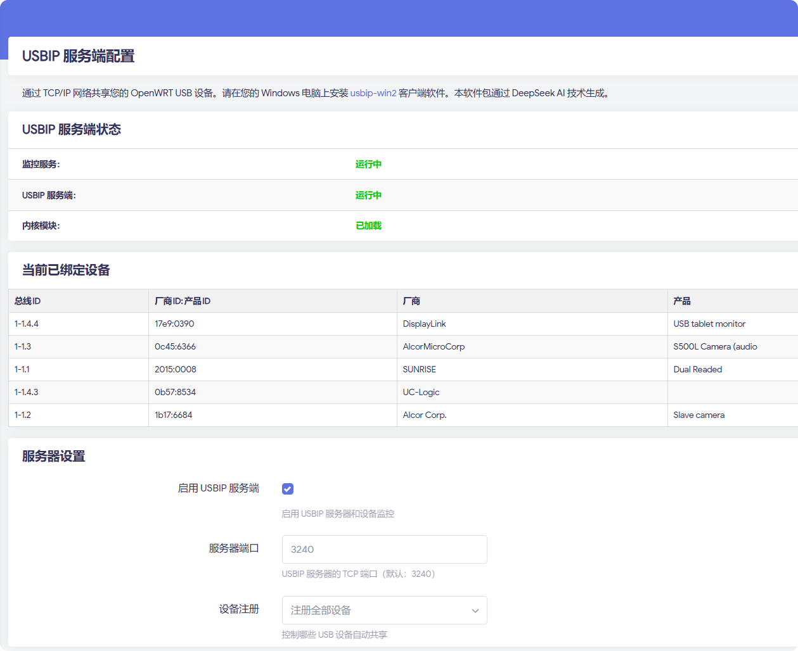

# luci-app-usbip-server

[English Documentation](README.EN.md)

## 项目简介

luci-app-usbip-server 是一个功能完善的 OpenWRT LuCI 应用程序，专为网络共享 USB 设备而设计。通过本插件，您可以轻松将 OpenWRT 设备配置为 USBIP 服务器，实现 USB 设备的网络共享，让多台客户端设备能够远程访问和使用服务器上连接的 USB 设备。



## 功能特性

- 🚀 **完整的 USBIP 服务器解决方案**
- 📱 **直观的 Web 管理界面**
- 🔄 **实时设备监控和自动绑定**
- ⚡ **基于 sysfs 的低资源消耗**
- 🌐 **多语言支持（中文/英文）**
- 🎯 **灵活的设备管理策略**
  - 全部设备共享
  - 白名单模式（仅共享选定设备）
  - 黑名单模式（共享除选定设备外的所有设备）

## 依赖包

- `usbip`
- `usbip-server` 
- `usbip-client`
- `kmod-usbip`
- `kmod-usbip-client`
- `kmod-usbip-server`
- `lua`
- `luci-base`
- `luci-compat`

## 系统要求

- OpenWRT 19.07 或更高版本
- 内核版本 4.14 或更高
- 至少 8MB 可用存储空间
- USB 控制器和至少一个 USB 设备

## 依赖包

- `usbip`
- `usbip-server` 
- `usbip-client`
- `kmod-usbip`
- `kmod-usbip-client`
- `kmod-usbip-server`
- `lua`
- `luci-base`
- `luci-compat`

## 安装方法

### 从源码编译

1. 将软件包放入 OpenWRT 构建系统：
```bash
cp -r luci-app-usbip-server ~/openwrt/package/
```

2. 配置并编译：
```bash
make menuconfig
# 在 LuCI -> Applications 中选择 luci-app-usbip-server
make package/luci-app-usbip-server/compile V=s
```

### 手动安装

1. 安装依赖包：
```bash
opkg update
opkg install usbip usbip-server usbip-client kmod-usbip kmod-usbip-client kmod-usbip-server
```

2. 安装语言包（如需中文界面）：
```bash
opkg install luci-i18n-base-zh-cn
```

3. 安装软件包：
```bash
opkg install luci-app-usbip-server_1.0.1-1_all.ipk
```

## 使用方法

### Web 界面管理

1. 登录 LuCI 管理界面
2. 导航到 **服务** → **USBIP 服务端**
3. 配置以下选项：

**基本设置：**
- ✅ **启用 USBIP 服务端** - 启用/禁用整个服务
- 🔢 **服务器端口** - USBIP 服务监听端口（默认：3240）

**设备注册模式：**
- 🌐 **全部设备** - 共享所有连接的 USB 设备
- ✅ **指定设备（白名单）** - 仅共享选定的设备
- ❌ **除指定设备外（黑名单）** - 共享除选定设备外的所有设备

**USB 设备列表：**
- 在白名单或黑名单模式下，从列表中选择要包含或排除的设备

### 客户端连接

**Windows 客户端：**
1. 安装 [usbip-win2](https://github.com/vadimgrn/usbip-win2)
2. 查看可用的 USB 设备：
```cmd
usbip list -r <OpenWRT设备IP>
```
3. 连接设备：
```cmd
usbip attach -r <OpenWRT设备IP> -b <设备busid>
```

**Linux 客户端：**
1. 加载 USBIP 内核模块：
```bash
modprobe usbip-core
modprobe vhci-hcd
```
2. 查看可用设备：
```bash
usbip list -r <OpenWRT设备IP>
```
3. 连接设备：
```bash
usbip attach -r <OpenWRT设备IP> -b <设备busid>
```

## 高级特性

### 智能设备管理
- **实时监控机制** - 通过事件驱动方式监控 USB 设备的热插拔状态
- **设备信息采集** - 自动获取并展示设备的详细信息（厂商、型号、设备ID等）
- **自动绑定策略** - 根据配置的管理策略自动处理新连接的 USB 设备

### 服务优化
- **资源管理** - 针对嵌入式设备优化，最小化 CPU 和内存占用
- **冲突检测** - 自动检测并处理与系统服务的潜在冲突
- **异常恢复** - 服务意外终止时具备自动恢复能力
- **日志记录** - 详细的操作和错误日志，便于问题排查

## 配置文件说明

主要配置文件路径：
```
/etc/config/usbip_server  # 主配置文件
```

配置项说明：
- `enabled` - 是否启用服务（0=禁用，1=启用）
- `port` - USBIP 服务器监听端口（默认：3240）
- `device_mode` - 设备注册模式（all=全部设备，whitelist=白名单，blacklist=黑名单）
- `devices` - 设备列表，在白名单/黑名单模式下使用

## 性能与安全

### 性能考虑
- 建议在网络带宽充足的环境下使用，特别是共享大容量存储设备时
- 对于高频率数据传输的设备（如摄像头、音频设备），可能会有延迟
- 监控服务占用极低，通常小于 1% CPU 和几 MB 内存

### 安全建议
- 建议在可信网络环境中使用本服务
- 考虑使用防火墙限制仅允许特定 IP 访问 USBIP 服务端口
- 定期更新 OpenWRT 系统和本插件以获取安全更新
- 对于敏感设备，建议使用白名单模式精确控制访问权限

## 故障排除

### 常见问题

**1. 设备无法绑定**
- 检查内核模块是否正确加载：`lsmod | grep usbip`
- 确认 USB 设备在系统中可见：`lsusb` 或检查 `/sys/bus/usb/devices/`

**2. 客户端无法连接**
- 确认防火墙允许 USBIP 端口（默认 3240）的 TCP 连接
- 验证服务正在运行：`ps | grep usbipd`

**3. 设备列表为空**
- 检查 USB 设备是否正确连接
- 确认 USB 控制器驱动已加载

### 日志查看
```bash
# 查看监控服务日志
logread | grep usbip-monitor

# 查看系统日志
logread
```

## 文件结构

```
/etc/config/usbip_server          # 配置文件
/etc/init.d/usbip_monitor         # 初始化脚本
/usr/bin/usbip_monitor.sh         # 监控主脚本
/usr/lib/lua/luci/controller/     # LuCI 控制器
/usr/lib/lua/luci/model/cbi/      # LuCI 配置界面
/www/luci-static/resources/view/  # Web 界面资源
```

## 开发与贡献

### 项目结构
```
luci-app-usbip-server/
├── Makefile                      # 构建配置
├── files/
│   ├── etc/
│   │   ├── config/               # 配置文件目录
│   │   └── init.d/               # 初始化脚本
│   ├── usr/
│   │   ├── bin/                  # 可执行脚本
│   │   └── lib/lua/luci/         # LuCI 模块
│   └── www/                      # Web 资源
└── po/                           # 多语言文件
```

### 技术栈
- **前端**: LuCI CBI 框架, JavaScript, HTML/CSS
- **后端**: Lua, Shell 脚本
- **系统**: OpenWRT, Linux USB 子系统

### 贡献指南
我们欢迎社区贡献，包括但不限于：
- 提交 Bug 报告和功能建议
- 改进代码和文档
- 添加新的语言支持
- 优化性能和安全性

请通过 GitHub Issues 和 Pull Requests 参与项目开发。

### 开发环境搭建
1. 按照 OpenWRT 官方文档设置构建环境
2. 将本项目添加到 OpenWRT 包目录
3. 使用 OpenWRT SDK 进行开发和测试

## 许可证

MIT License

## 免责声明

本软件按"原样"提供，不附带任何明示或暗示的担保。使用者需自行承担使用风险。

## 致谢

感谢所有为 USBIP 技术发展做出贡献的开发者和社区成员。

---

**注意**: 使用本软件前，请确保您了解 USBIP 协议的安全影响，特别是在网络环境中共享 USB 设备时可能面临的安全风险。